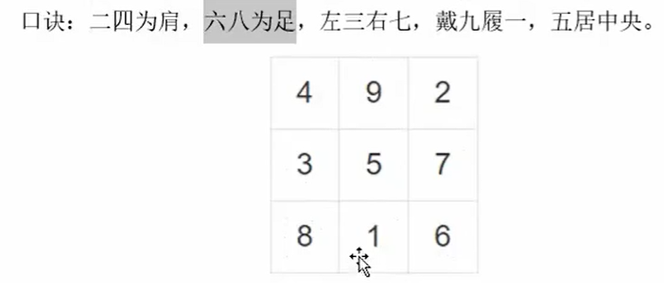

#### [目录](index.md)
#### [上一页](index.md)
#### [下一页](day2.md)

== 2025/09/22 周一 ==

#### [翻转数组](./code/翻转数组.cpp)

#### [幻方](./code/幻方.cpp)

三阶幻方,每行每列每个对角线和相等,都是15

#### [大整数相加](./code/大整数相加.cpp)

> 实际应用中，有时会遇到非常大的整数，可能会超过 `long`、甚至 `long long` 的范围。这时就需要用不限长度的字符串保存数据，然后进行计算。  

> 最简单的需求就是“大整数相加”，即给定两个字符串形式的非负大整数 `num1` 和 `num2`，计算它们的和。  

> 我们可以把字符串按每个字符一一拆开，相当于遍历整数上的每一个数位，然后通过“乘 10 叠加”的方式，就可以整合起来了。这相当于算术中的“竖式加法”。

#### [旋转图片](./code/旋转图片.cpp)

> 旋转图像的需求，在图片处理的过程中非常常见。我们知道对于计算机而言，图像其实就是一组像素点的集合，所以图像旋转的问题，本质上就是一个二维数组的旋转问题。

#### [翻转链表](./code/Project1/翻转链表.cpp)

> 链表（LinkedList）是一种常见的基础数据结构，它是一种线性表，但是并不会像数组那样按顺序存储数据，而是在每一个节点里存指向下一个节点的指针。

#### [目录](index.md)
#### [上一页](index.md)
#### [下一页](day2.md)