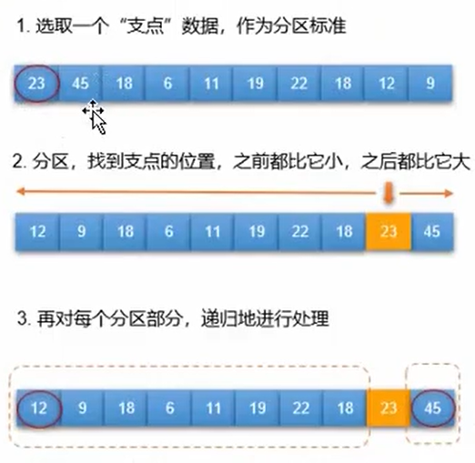

#### [目录](index.md)
#### [上一页](day1.md)
#### [下一页](day3.md)
== 2025/09/23 周二 ==

#### [为啥头文件要写#pragma once](./node/头文件保护.md)

#### [函数](./node/函数.md)

例子[求n的阶层](./code/求n的阶层.cpp)

[变量的作用域和生命周期](./note/变量的作用域和生命周期.md)

#### [斐波那契数列](.\code\递归斐波那契.cpp)

从第三位开始,每一个数字都是前两个数字的和.
用递归求第n位的数的值

#### [二分查找](./code/二分查找.cpp)

也叫折半查找,高效的查找方法,前提:有序

#### [快速排序](./code/qsort.cpp)

> 之前介绍过两种对一组数据进行排序的算法：**选择排序和冒泡排序**，它们都需要使用两层 `for` 循环遍历数组，效率较低。  
> 一种巧妙的改进思路是：通过一次扫描，将待排记录分隔成独立的两部分，其中一部分的值全比另一部分的小；接下来分别对这两部分继续进行排序，最终全部排完。  
> 这种算法更加高效，被称为“快速排序”。

#### [目录](index.md)
#### [上一页](day1.md)
#### [下一页](day3.md)