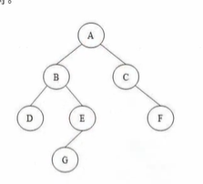

#### [目录](index.md)
#### [上一页](day2.md)
#### [下一页]()
== 2025/09/24 周三 ==

#### [遍历二叉树](./code/Project1/遍历二叉树.cpp)

二叉树:每个节点只有两个子节点.以子节点作为根的两个树,左子树and右子树

1. 先序遍历:根左右
2. 中序遍历:左根右
3. 后序遍历:左右根

### C++较于C的函数新特性

#### 内联函数

> 内联函数是 C++ 为了提高运行速度做的一项优化。

> 函数让代码更加模块化，可重用性、可读性大大提高；不过函数也有一个缺点：  
函数调用需要执行一系列额外操作，会降低程序运行效率。

> 为了解决这个问题，C++ 引入了“内联函数”的概念。  
使用内联函数时，编译器不再去做常规的函数调用，而是把它在调用点上“内联”展开，  
也就是直接用函数代码替换了函数调用。

> 定义内联函数,只需要在函数声明或者函数定义前加上`inline`关键字

#### [默认实参](./code/默认实参.cpp)

> 在有些场景中，当调用一个函数时它的某些形参一般都会被赋一个固定的值。  
为了简单起见，我们可以给它设置一个“默认值”，这样就不用每次都传同样的值了。

> 这种会反复出现的默认值，称为函数的**默认实参**。  
当调用一个有默认实参的函数时，这个实参可以省略。

#### 函数重载
> 在 C++ 中，同一作用域下，同一个函数名是可以定义多次的，前提是*形参列表不同*。  
这种名字相同但形参列表不同的函数，叫做**重载函数**。  
这是 C++ 相对 C 语言的重大改进，也是面向对象的基础。

> 这里需要注意：

- 重载的函数，应该在**形参的数量**或者**类型**上有所不同。 
- 常量作为形参,和不加const完全等价,不能重载
- 形参的名称在类型检查中可以省略，所以**只有形参名不同**的函数是一样的。  
- 调用函数时，编译器会根据传递的**实参个数和类型**，自动推断使用哪个函数。  
- **主函数不能重载**。

#### 函数匹配

1. 候选函数

找到对应的重载函数,两个要求:

	* 与调用函数同名

	* 函数的声明,在函数的调用点是可见的 

2. 可行函数

> 接下来需要从候选函数中，选出跟传入的实参匹配的函数，这些函数叫做“可行函数”。可行函数也有两个要求：

	- 形参个数与调用传入的实参数量相等

	- 每个实参的类型与对应形参的类型相同，或者可以转换成形参的类型

3. 寻找最佳匹配

> 最后就是在可行函数中，选择最佳匹配。简单来说，实参类型与形参类型越接近，它们就匹配得越好。所以，能不进行转换就实际匹配的，要优于需要转换的。

4. 多参数的函数匹配

> 如果实参的数量不止一个，那么就需要逐个比较每个参数；同样，类型能够精确匹配的要优于需要转换的。这时寻找最佳匹配的原则如下：

	- 如果可行函数的所有形参都能精确匹配实参，那么它就是最佳匹配
	- 如果没有全部精确匹配，那么当一个可行函数所有参数的匹配，都不比别的可行函数差、并且至少有一个参数要更优，那它就是最佳匹配

5. 二义性调用

如果检查了所有的实参之后,有多个可行函数不分优劣,无法找到一个最佳匹配,那么编译器就会报错,称之为"二义性调用"。

#### 重载与作用域

> 重载是否生效，跟作用域是有关系的。如果在内层、外层作用域分别声明了同名的函数，那么内层作用域中的函数会覆盖外层的同名实体，让它隐藏起来。不同的作用域中，是无法重载函数名的。

#### [函数指针](./code/函数指针.cpp)

> 有了指向函数的指针，就给函数带来了更加丰富灵活的用法。  
例如，可以将函数指针作为形参定义在另一个函数中——也就是说，可以定义一个函数，它以“另一个函数类型”作为形参。  

> 当然，函数本身不能作为形参；不过函数指针完美地填补了这个空缺。  
这一点上，函数跟数组非常类似。 

#### [目录](index.md)
#### [上一页](day2.md)
#### [下一页]()