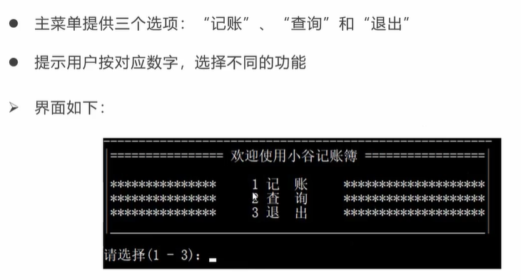

#### [目录](index.md)
#### [上一页](day3.md)
#### [下一页](day5.md)

== 2025/09/25 周四 ==
#### 整体描述
- 软件基于命令行，以文本方式实现交互。  
- 主要有两大功能：**记账** 和 **查询**，并提供“退出”选项。  
- 数据需持久化保存，可存储在文本文件中。

#### 具体功能
##### 记账功能
- 记录每一笔**收入**与**支出**。

##### 查询功能
- 查询当前所有账目，并统计总收支；  
  支持三种子选项：  
  - 查询全部账  
  - 查询收入  
  - 查询支出  

#### 菜单设计
- 采用**分级菜单**形式；  
- 每一级菜单均提供“返回主菜单”选项。


1. 记账
	- 收入
	- 支出
	- 返回主菜单
2. 查询
	- 查询所有账目
	- 查询所有收入
	- 查询所有支持
	- 统计
3. 退出
	- (y/n)




#### 数据结构设计
- 每一条账目数据，都应包含 **收支类型**、**金额**、**备注** 三部分，可构建结构体类型 `AccountItem` 来表示。  
- 保存在文件中的数据，读取后应存入一个 `AccountItem` 类型的 `vector` 容器。

#### 流程控制设计
- 用户不选择退出，程序就不结束：用 `while` 循环处理整体流程；用户确认退出时修改标志位以跳出循环。  
- 每一级菜单的键盘选择后，用 `switch` 分支语句处理。  
- 不同功能模块封装成独立函数。

#### 项目的文件分类

[account_item.h](./code/Project2/account_item.h)  结构体定义,涉及账目操作的函数声明

[common.h](./code/Project2/common.h)  通用设置;通用功能性函数声明

[main.cpp](./code/Project2/main.cpp)  主体代码

[meuns.cpp](./code/Project2/meuns.cpp)  绘制菜单函数

[read_input.cpp](./code/Project2/read_input.cpp)  读取输入函数

[operations.cpp](./code/Project2/operations.cpp)  涉及账目操作的函数


> [!TIP]
>
> g++ -finput-charset=utf-8 -fexec-charset=gbk a.cpp -o a
> 
> -finput-charset=utf-8 源文件是utf-8
> -fexec-charset=gbk  可执行是gbk

```bash
# 编译项目,并将可执行文件用gbk编码
g++ -finput-charset=utf-8 -fexec-charset=gbk main.cpp meuns.cpp operations.cpp read_input.cpp -o a.exe
```


[目录](index.md)
[上一页](day3.md)
[下一页](day5.md)