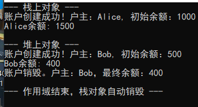

#### [目录](index.md)
#### [上一页](day4.md)
#### [下一页](day6.md)

== 2025/09/27 周四 ==

### 面向对象编程

#### [银行类](./code/Project3/BankAccount.h)

运行结果:

#### [矩形类](./code/Project4/Rectangle.h)

---

### 类的声明和定义
#### 类的声明 (Class Declaration)

告诉编译器类的名称和结构

**通常在头文件(.h)中声明**

#### 类的定义 (Class Definition)

实现类的成员函数

**通常在源文件(.cpp)中定义**

#### 访问权限

* public：任意可见
* protected：本类 + 派生类可见
* private：仅本类* 

### 构造函数

**构造函数的特点**

* 与类同名，没有返回类型
* 可以重载（多个构造函数）
* 在创建对象时自动调用

#### [目录](index.md)
#### [上一页](day4.md)
#### [下一页](day6.md)