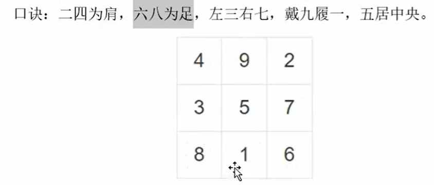
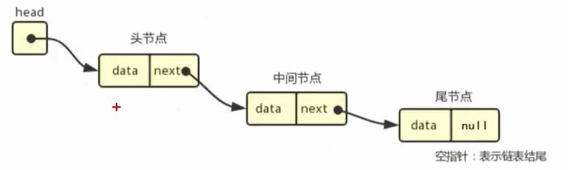

== 2025/09/22 周一 ==

#### [翻转数组](./code/翻转数组.cpp)

#### [幻方](./code/幻方.cpp)

三阶幻方,每行每列每个对角线和相等,都是15

#### [大整数相加](./code/大整数相加.cpp)

> 实际应用中，有时会遇到非常大的整数，可能会超过 `long`、甚至 `long long` 的范围。这时就需要用不限长度的字符串保存数据，然后进行计算。  

> 最简单的需求就是“大整数相加”，即给定两个字符串形式的非负大整数 `num1` 和 `num2`，计算它们的和。  

> 我们可以把字符串按每个字符一一拆开，相当于遍历整数上的每一个数位，然后通过“乘 10 叠加”的方式，就可以整合起来了。这相当于算术中的“竖式加法”。

#### [旋转图片](./code/旋转图片.cpp)

> 旋转图像的需求，在图片处理的过程中非常常见。我们知道对于计算机而言，图像其实就是一组像素点的集合，所以图像旋转的问题，本质上就是一个二维数组的旋转问题。

#### [翻转链表](./code/Project1/翻转链表.cpp)

> 链表（LinkedList）是一种常见的基础数据结构，它是一种线性表，但是并不会像数组那样按顺序存储数据，而是在每一个节点里存指向下一个节点的指针。

== 2025/09/23 周二 ==

#### [为啥头文件要写#pragma once](./node/头文件保护.md)

#### [函数](./node/函数.md)

例子[求n的阶层](./code/求n的阶层.cpp)

> 在 C++ 中，作用域指的是变量名字的可见范围：变量不可见，并不代表变量
所指代的数据对象就销毁了。这是两个不同的概念：

- 作用域：针对名字而言，是程序文本中的一部分，名字在这部分可见；
- 生命周期：针对数据对象而言，是程序在执行过程中，对象从创建到销毁的时间段。

> 基于作用域，变量可以分为“局部变量”和“全局变量”。对于全局变量而言，名字全局可见，对象也只有在程序结束时才销毁。

> 而对于局部变量代表的数据对象，基于生命周期，又可以分为“自动对象”和“静态对象”。

>（1）自动对象  
平常代码中定义的普通局部变量，生命周期为：在程序执行到变量定义语句时创建，在程序运行到当前块末尾时销毁。这样的对象称为“自动对象”。  
形参也是一种自动对象。形参定义在函数体作用域内，一旦函数终止，形参也就被销毁了。  
对自动对象来说，它的生命周期和作用域是一致的。

>（2）静态对象  
如果希望延长一个局部变量的生命周期，让它在作用域外依然保留，可以在定义局部变量时加上 `static` 关键字；这样的对象叫做“局部静态对象”。  
局部静态对象只有局部的作用域，在块外依然是不可见的；但是它的生命周期贯穿整个程序运行过程，只有在程序结束时才被销毁，这一点与全局变量类似。